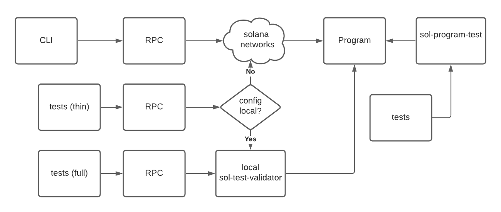

## About
`solana-cli-program template` is a sample app demonstrating the creation of a minimal CLI application written in Rust to interact with Solana and programs.
It provides multiple pieces of functionality:

- `ping`: Creates a transaction sending 0 SOL from the signer's account to the signer's account. Returns the signature of the transaction.
- `mint`: Mint a key/value pair to an owning account.
- `transfer`: Transfer a key, and it's value, from one owning account to another.
- `burn`: Burn (delete) a key, and it's value, from an owning account.
- `balance`: Returns an account's balance.
- `help`: Tips for using the app. This is an off-chain operation.

## Structure
A functional macro level view



## Quick start
1. Install Rust from https://rustup.rs/
2. Clone this repo
3. If running the integration tests or Mint, Transfer, Burn instructions:
  ```
  cd program
  cargo build-bpf
  cd ..
  ```
4. `cargo run help`

## Sample keys
The repo includes sample keys for 'owners'. There are two owner accounts predefined `User1` and `User2`, each with two keypairs defined:
1. An owners 'wallet' account. This is funded by the Solana configurations default account and is used to fund _program accounts_.
2. An owners program 'account' which is used by the sample program for mint, transfer and burn operations
- There is a third account called `Service` which is used for program instructions that exact a fee for the instruction execution. These are executed as part of the integration tests only

## Running locally step-by-step
1. If not running Mint, Transfer and/or Burn:
  - Start a local node: run `solana-test-validator`.
  - Optionally generate a keypair: `solana-keygen new -o test.json`.
  - Optionally add 100 SOL to the corresponding account `solana airdrop --url http://127.0.0.1:8899 --keypair test.json 100`.

2. For running Mint, Transfer and/or Burn locally:
  - Start a local node and load the sample program
  - To run with a brand new ledger:
  `solana-test-validator --bpf-program SampGgdt3wioaoMZhC6LTSbg4pnuvQnSfJpDYeuXQBv ~/solana-cli-program-template/target/deploy/solana_cli_template_program_bpf.so --ledger ~/solana-cli-program-template/.ledger --reset`
  - To run with keeping the state of previous ledger
  `solana-test-validator --ledger ~/solana-cli-program-template/.ledger`

3. For running Mint, Transfer and/or Burn on DEVNET:
  - The sample program is already on Devnet

4. Build app: `cargo run`.

5. Ping:
  ```
  $ cargo run -- ping --url http://127.0.0.1:8899 --keypair test.json
  Signature: 2Y863JX96RTqbeGfcvQowVt1V91Dgs2LZfVgQ3mGJPmYu24sUTYmfkArHAAgj4uFqP75bm9GXU9DYjiMFxahQJUC
  ```

6. Mint (no fee):
  ```
  cargo run -- mint --url http://127.0.0.1:8899 -t User1 -k AKey --value Minted key value pair
  User1 to account key/value store {"AKey": "Minted key value pair"}
  ```
7. Transfer (no fee):
  ```
  cargo run -- transfer --url http://127.0.0.1:8899 -f User1 -t User2 -k AKey
  User1 from account key/value store {}
  User2 to account key/value store {"AKey": "Minted key value pair"}
  ```
8. Burn (no fee):
  ```
  cargo run -- burn --url http://127.0.0.1:8899 -f User2 -k AKey
  User2 from account key/value store {}
  ```

9. Balance:
  ```
  $ cargo run -- balance --url http://127.0.0.1:8899 --keypair test.json
  3dSRGE3wYCcGWFrxAsQs5PaBqtJzzxdTzY2ypXNFUji9 has a balance of ◎99.999995000 // balance less than 100 because of ping operation above
  ```
  ```
  $ cargo run -- balance --url http://127.0.0.1:8899 --keypair keys/accounts/user1_account.json
  A94wMjV54C8f8wn7zL8TxNCdNiGoq7XSN7vWGrtd4vwU has a balance of ◎0.008017920 // after first running 'mint'
  ```
10. Run help for the complete list of options:
  ```
  $ cargo run -- --help
  cli-program-template 0.1.0


  USAGE:
      cli-program-template [FLAGS] [OPTIONS] <SUBCOMMAND>

  FLAGS:
      -h, --help       Prints help information
      -V, --version    Prints version information
      -v, --verbose    Show additional information

  OPTIONS:
      -C, --config <PATH>        Configuration file to use [default: /Users/user/.config/solana/cli/config.yml]
          --url <URL>            JSON RPC URL for the cluster [default: value from configuration file]
          --keypair <KEYPAIR>    Filepath or URL to a keypair [default: client keypair]

  SUBCOMMANDS:
    balance     Get balance
    burn        Burn (delete) a key/value pair from an account
    help        Prints this message or the help of the given subcommand(s)
    mint        Mint a new key/value pair to an account
    ping        Send a ping transaction
    transfer    Transfer a key/value pair from one account to another
  ```